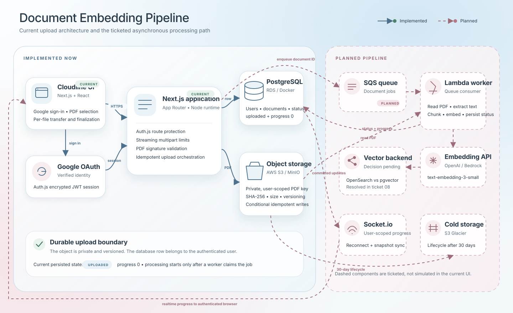

# Document Embedding Pipeline

Upload documents, convert them into vector embeddings, and watch the progress in
real time.

Authenticated users upload PDFs; the files land in S3, a queue hands them to
workers that extract text, chunk it, generate embeddings, and write the vectors
to a vector store. Progress streams back to the browser over WebSocket. This is
an **ingestion pipeline only** — querying the embeddings is out of scope.

The full problem statement, user stories and technical decisions live in
[`.scratch/document-embedding-pipeline/spec.md`](.scratch/document-embedding-pipeline/spec.md).
Work is tracked as numbered tickets under
[`.scratch/document-embedding-pipeline/issues/`](.scratch/document-embedding-pipeline/issues/).

## Status

Tickets 01–04 and 13 are complete. The application foundation, Postgres schema,
Google authentication, Cloudline design system, and authenticated S3 upload
flow are in place. The queue and embedding pipeline arrive in tickets 05–12.

## Architecture

[](docs/architecture.svg)

Solid components are implemented today. Dashed components are the ticketed
processing path and are not simulated by the current UI. The vector backend
remains intentionally undecided until ticket 08 resolves the spec's
OpenSearch-versus-pgvector conflict.

## Prerequisites

- Node.js 20 or newer (developed against 24)
- npm 10 or newer
- Docker, for local Postgres with pgvector and S3-compatible MinIO

## Setup

```bash
npm install
cp .env.example .env.local

# Fill AUTH_GOOGLE_ID and AUTH_GOOGLE_SECRET from a Google OAuth 2.0 web client.
# Generate a local session-encryption secret:
openssl rand -base64 32

# Postgres 17 with pgvector, matching what the app expects
docker run -d --name dep-postgres \
  -e POSTGRES_USER=dep \
  -e POSTGRES_PASSWORD=dep_local_dev \
  -e POSTGRES_DB=document_embedding_pipeline \
  -p 5432:5432 \
  pgvector/pgvector:pg17

# Separate database for integration tests, which truncate between cases
docker exec dep-postgres \
  createdb -U dep document_embedding_pipeline_test

npm run db:migrate     # apply migrations
npm run db:seed        # optional: a dev user and one document per status
npm run storage:start  # MinIO plus dev/test buckets
npm run dev
```

The app runs at http://localhost:3000.

Create an OAuth 2.0 **Web application** client in Google Cloud Console and add
`http://localhost:3000/api/auth/callback/google` as an authorized redirect URI.
Put the generated client ID, client secret, and the `openssl` output in
`.env.local`. For staging and production, use each deployment's equivalent
HTTPS callback URL.

Configuration is validated at startup, so a missing or malformed variable stops
the boot with a message naming it rather than failing later at the point of use.

## Authentication

The sign-in page is public; application routes are protected by
[`src/proxy.ts`](src/proxy.ts). Auth.js stores an encrypted JWT session in an
HTTP-only cookie for 30 days and refreshes active sessions. On each verified
Google sign-in, the profile is upserted by Google's stable subject into the
`users` table, while name, email and photo are refreshed.

The Google OAuth callback is:

```text
http://localhost:3000/api/auth/callback/google
```

Auth.js rejects Google profiles whose email is not verified.

## Document uploads

The authenticated workspace accepts up to 10 PDFs per selection, 5 MB each.
Each file is uploaded independently so the browser can report truthful per-file
transfer progress. A streaming multipart parser enforces the size and part
limits before buffering more than one configured file. The API validates the
filename, MIME type, size, and PDF signature again; stores the object under a
user-scoped key derived from a stable upload UUID; and only then creates the
document row as `uploaded` with zero processing progress. Retrying the same UUID
returns the existing document instead of creating duplicates. Request handlers
never delete stored content while another finalizer may still commit. Verified
objects without a document row are treated as in-flight for five minutes, then
the same upload UUID can safely finalize the database row against that object.
Exact-version deletion remains available for a later reconciled GC/lifecycle
job.

Local development uses MinIO through the same AWS SDK adapter as production.
MinIO runs at http://localhost:9000, with its console at
http://localhost:9001. Local buckets enable versioning so rollback behavior is
tested against versioned storage. Production should omit `S3_ENDPOINT` and
static credentials, use an IAM role, and leave `S3_FORCE_PATH_STYLE=false`.
The SDK default credential chain is left intact, including temporary session
tokens used by Lambda, STS, and assumed roles.

## Interface

Cloudline is the application's original visual system. It uses a cloud-blue and
blush atmospheric canvas, slate-blue ink, Manrope display typography, capsule
actions, high-radius surfaces, and restrained depth. Tokens live in
[`src/app/globals.css`](src/app/globals.css); shared state primitives live under
[`src/components/ui`](src/components/ui), and the responsive authenticated shell
is [`src/components/layout/app-shell.tsx`](src/components/layout/app-shell.tsx).

The interface renders only persisted document states: `uploaded`, `processing`,
`complete`, and `error`. Unknown processing progress is indeterminate; named
internal phases are not inferred in the browser.

## Commands

| Command                  | Purpose                                     |
| ------------------------ | ------------------------------------------- |
| `npm run dev`            | Development server with hot reload          |
| `npm run build`          | Production build                            |
| `npm start`              | Serve a production build                    |
| `npm test`               | Unit tests, no database needed              |
| `npm run test:watch`     | Re-run unit tests on change                 |
| `npm run test:integration`| Tests against a real Postgres              |
| `npm run typecheck`      | Type-check without emitting                 |
| `npm run lint`           | ESLint                                      |
| `npm run db:migrate`     | Create and apply a migration (development)  |
| `npm run db:deploy`      | Apply existing migrations (deployment)      |
| `npm run db:generate`    | Regenerate the Prisma client                |
| `npm run db:seed`        | Load development data                       |
| `npm run db:studio`      | Browse the database                         |
| `npm run storage:start`  | Start MinIO and create dev/test buckets     |
| `npm run storage:stop`   | Stop local MinIO without deleting its volume|

## Configuration

Variables are declared and validated in [`src/lib/env.ts`](src/lib/env.ts), and
documented in [`.env.example`](.env.example).

`APP_ENV` (`development` / `staging` / `production`) is kept separate from
`NODE_ENV` because Next.js only recognises development, test and production —
it has no notion of staging. Read configuration through `serverEnv()` rather
than `process.env` so that validation and typing are not bypassed; server
configuration throws if it is reached from the browser, and `clientEnv()`
exposes only the `NEXT_PUBLIC_` subset.

Pipeline limits (`MAX_UPLOAD_FILES`, `MAX_FILE_SIZE_MB`,
`MAX_PROCESSING_CONCURRENCY`) default to the values in the spec — 10 files, 5 MB
each, 10 documents processed concurrently — and can be overridden per
environment.

## Project structure

```
src/
├── app/          Next.js App Router — routes, layouts, API handlers
├── auth.ts       Auth.js callbacks, session projection and profile sync
├── auth.config.ts Provider and route authorization policy
├── components/
│   └── ui/       shadcn/ui primitives
├── lib/          Framework-agnostic utilities (env config, helpers)
├── services/     Business logic — the seam unit tests target
├── types/        Shared domain types
└── instrumentation.ts   Validates configuration once, at server startup
```

`services/` is deliberately separate from `app/`: the spec names the service
layer as the primary test seam, so business logic lives there rather than inside
route handlers.

## Testing

[Vitest](https://vitest.dev) with Testing Library. Tests sit next to the code
they cover as `*.test.ts`.

Tests run in the **node** environment by default. jsdom defines a global
`window`, which trips the browser guard in `serverEnv()` and would make every
service-layer test fail for the wrong reason. Component tests opt into a DOM
with a docblock at the top of the file:

```ts
// @vitest-environment jsdom
```

```bash
npm test                    # everything
npm test -- src/lib/env     # one file
npm run test:integration    # migrations + database-backed seams
```

Integration tests also exercise the S3 adapter and upload route against MinIO,
so run `npm run storage:start` first.

## Tech stack

Next.js 16 (App Router) · React 19 · TypeScript · Tailwind CSS v4 ·
shadcn/ui · Manrope + Geist · Auth.js v5 with Google OAuth · AWS S3 (MinIO
locally) · PostgreSQL with pgvector · Zod · Vitest

Planned for later tickets: AWS SQS + Lambda, OpenAI embeddings, OpenSearch,
Socket.io.

## Troubleshooting

**`npm error code EALLOWREMOTE` on install.** Some corporate npm proxies serve
package metadata whose tarball URLs point at a different host, which npm 12
classifies as "remote" and blocks by default. Install with:

```bash
npm_config_allow_remote=all npm install
```
